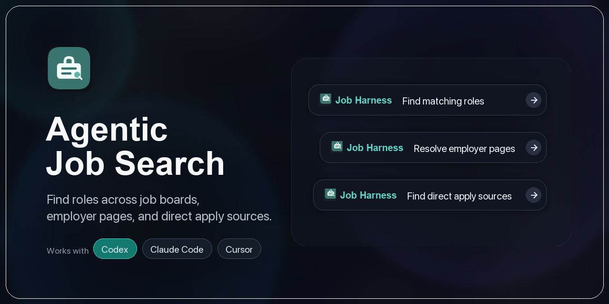

# job-harness

Job Search OS for AI agents. Tell the agent what kind of role you want; it
searches job boards and company career pages, filters the results, and gives you
a report you can actually review.

## Why

Most job searches get trapped inside one or two aggregators. That misses roles
posted only on company career pages and creates a lot of repeated manual work:
open a board, search, filter, dedupe, save links, repeat. Job-harness gives that
work to an AI agent.

## What You Get

- Broader search: aggregators plus employer career pages in one workflow.
- Less noise: the agent applies your criteria instead of dumping every match.
- Repeatable runs: results are saved with both raw evidence and a readable HTML
  report.
- Easy follow-up: the same run can be extended with more query variants instead
  of starting over.

## Where It Searches

Job-harness is useful because it looks outside the usual single-board search
bubble. Today the v2 workflow searches 17 implemented sources:

- Major aggregators and job boards: HH.ru, Habr Career, GeekJob, GetMatch,
  Finder, Hirify, HireHi, JobTurbo, Talanto, Talento, IT Jobs Uzbekistan, and
  Staff.am.
- Direct employer career pages: VK, JetBrains, IBS, amoCRM, and CoinsPaid.

The agent searches the full catalog by default. You can narrow sources only when
you explicitly want to.

The source list is expected to grow. Keep the plugin updated so new boards,
company career pages, parser fixes, and filtering improvements are available;
see [Update](#update) after installation.

## Where It Runs

- **Codex**: install the plugin and ask Codex to run a job search.
- **Claude Code**: install the plugin and use `/job-search`.
- **Cursor**: clone this repository, open it in Cursor, and Cursor will use the
  root `AGENTS.md` instructions for repository work.

## Installation

Job-harness is updated actively because new sources and source fixes are added
over time. After installing, configure updates in [Update](#update): enable
Claude Code auto update, and use the Codex or Cursor update steps for those
environments.

Choose the app where you want to use job-harness and follow that section only.
Before you start, check only the commands for your path:

```bash
codex --version   # Codex install
claude --version  # Claude Code install
git --version     # Cursor checkout
uv --version      # job-harness runtime and local CLI
```

If a command for your path is missing, install that app first and then return to
this section.

### Codex

Use this when you want Codex to run job searches as an installed plugin.

1. Open a terminal.
2. Add the job-harness marketplace:

```bash
codex plugin marketplace add https://github.com/feodal01/job-harness.git --ref main
```

3. Install the plugin from that marketplace:

```bash
codex plugin add job-harness@job-harness
```

4. Start a new Codex session.
5. Ask Codex for a job search, for example:

```text
Find QA jobs matching my brief.
```

If Codex does not show the new skills or MCP tools right away, close the current
session and start another one.

### Claude Code

Use this when you want Claude Code slash commands such as `/job-search`.

1. Open a terminal.
2. Add the job-harness marketplace:

```bash
claude plugin marketplace add feodal01/job-harness#main
```

3. Install the plugin:

```bash
claude plugin install job-harness@job-harness --scope user
```

4. Check that Claude Code sees it:

```bash
claude plugin list
```

5. Restart Claude Code.
6. Run a search from Claude Code:

```text
/job-search Find QA jobs matching my brief
```

You can also open `/plugins` in Claude Code, browse the `job-harness`
marketplace, and install or update the plugin from the UI.

### Cursor

Cursor uses this repository as a workspace. There is no separate Cursor plugin
install step for job-harness.

1. Open a terminal.
2. Clone the repository:

```bash
git clone https://github.com/feodal01/job-harness.git
cd job-harness
```

3. Install the Python environment used by the job-harness CLI:

```bash
uv --directory plugins/job-harness sync
```

4. Open Cursor.
5. Choose **File -> Open Folder...**.
6. Select the cloned `job-harness` folder.
7. Open Cursor Agent chat in that workspace. Cursor will pick up the root
   `AGENTS.md` instructions for this repository.
8. Use Cursor's terminal to confirm the CLI works:

```bash
uv --directory plugins/job-harness run job-harness-v2 list-sources
```

After that, ask Cursor Agent to work in this repository, for example:

```text
Use job-harness to inspect the v2 search workflow.
```

## Update

The catalog changes over time. Update regularly so searches include the newest
implemented sources and fixes.

### Claude Code

Set up auto update first:

1. Open `/plugins` in Claude Code.
2. Go to **Marketplaces -> job-harness** and enable **Auto update**.
3. Go to **Installed -> job-harness** and choose **Add to favorites**.
4. Choose **Update now** when you want to update immediately.

CLI update:

```bash
claude plugin update job-harness
```

Restart Claude Code if newly installed skills, slash commands, agents, or MCP
tools do not appear right away.

### Codex

Codex updates from the configured Git marketplace snapshot. There is no
auto-update step in the current Codex CLI; refresh the snapshot and reinstall
the plugin when you want the latest version:

```bash
codex plugin marketplace upgrade job-harness
codex plugin add job-harness@job-harness
```

Start a new Codex session if newly installed skills or MCP tools do not appear
right away.

### Cursor

Cursor uses the repository checkout directly. Update the checkout and reload
Cursor:

```bash
git pull
uv --directory plugins/job-harness sync
```

Then run **Developer: Reload Window** in Cursor so it reloads the updated
`AGENTS.md` instructions and workspace files.

If Cursor imports MCP servers from an installed Claude Code plugin, Claude Code
auto update can keep those imported MCP entries current. It does not update this
repository checkout; use `git pull` for Cursor workspace updates.
