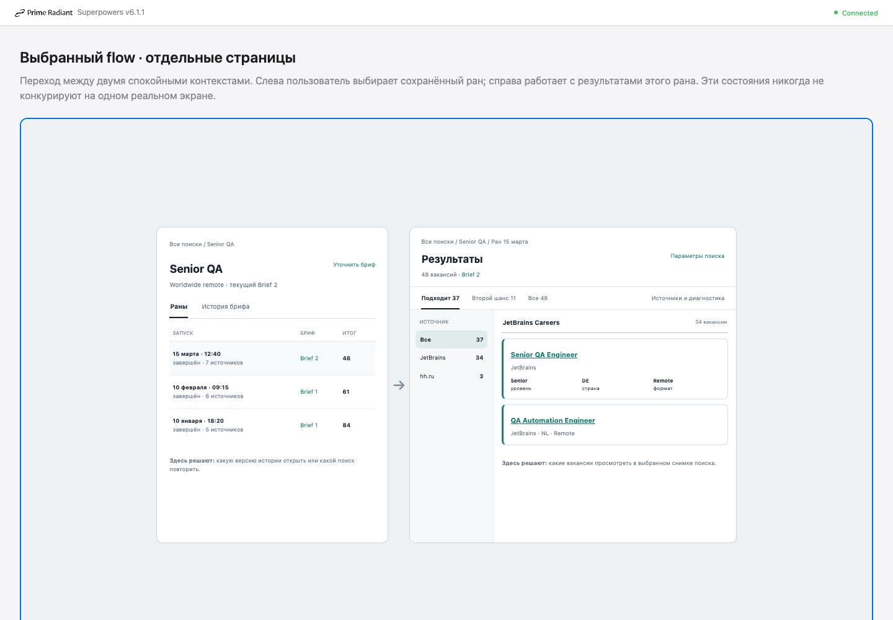
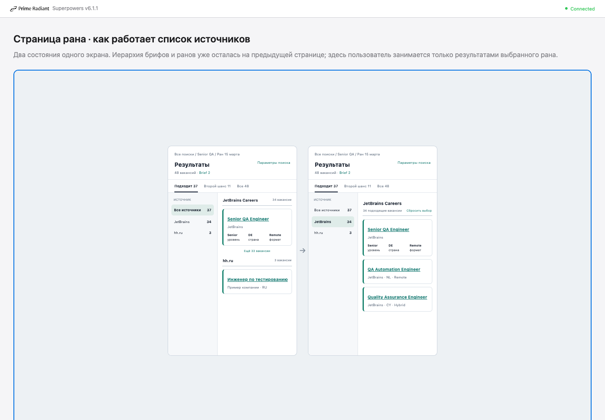

# Local Search Workspace Service — Design Specification

**Status:** Draft for user review

**Date:** 2026-07-21

**Repository:** `qa-job-harness`

## 1. Summary

Job Harness will gain a local human-facing web application without replacing
the existing agent workflow or v2 search engine.

The product is a **local workspace application**:

- a nontechnical user can start it by double-clicking one macOS launcher file
  or running one terminal command;
- no separately installed Python, `uv`, Node.js, Docker, or Homebrew package is
  required at runtime;
- the backend and frontend operate against a user-selected artifact workspace;
- the agent and the local application use the same workspace contract and the
  same `V2SearchApplication` boundary;
- the service is optional for the agent and never becomes the canonical owner
  of search data;
- searches launched by either actor appear in the same UI after the workspace
  is rescanned;
- all current v2 search features remain available at the application boundary,
  including repeated query formulations and engine-level append/resume.

The MVP is a local web application, not a cloud service and not a native macOS
application. Native packaging can be reconsidered after the workflow is proven.

## 2. Problem

Today the v2 engine is primarily operated by an AI agent through the plugin
skill and CLI. This creates two adoption barriers:

1. not every user has an agent environment;
2. agent environments often require a VPN that interferes with access to local
   job sources such as hh.ru.

A human must be able to use the complete search workflow directly on the same
machine and network where the sources are reachable. At the same time, users
who do have an agent must not lose the agent workflow: agent-created briefs,
runs, reports, and results must become visible in the application.

## 3. Goals

The MVP must:

1. expose the full v2 `SearchRequest`, including **1–20 normalized unique query
   formulations** in one search;
2. preserve a durable evolution of a search direction across brief revisions
   and repeated runs;
3. preserve every completed run and allow an old brief revision to be rerun as
   a new snapshot;
4. make agent-created and frontend-created changes converge in one workspace;
5. keep canonical user data portable as ordinary workspace artifacts;
6. launch locally without a developer toolchain;
7. keep hh.ru and other network access local to the user's machine;
8. retain the current report's vacancy-card presentation while improving
   navigation, source visibility, and request readability;
9. distinguish product results from engine diagnostics and raw artifacts;
10. fail visibly and recoverably rather than silently truncating requests or
    overwriting old results.

## 4. Non-goals

The MVP does not include:

- a hosted multi-user service;
- cloud sync or merging workspace changes from multiple machines;
- authentication between different human users;
- a native Swift/AppKit macOS UI;
- Homebrew distribution;
- a mandatory Docker runtime;
- branching or forking one search direction into another;
- a user-facing append action;
- a relevance score or sorting promise that the engine cannot currently
  justify;
- arbitrary editing of generated engine artifacts;
- importing or displaying Runs created under the old separate
  `.job-harness/briefs/` + `.job-harness/v2/runs/` layout;
- compatibility adapters preserving the old artifact contract after the new
  workspace contract is adopted.

## 5. Product concepts

### 5.1 Workspace

A Workspace is one user-selected directory containing `.job-harness/`.
One local service process opens one Workspace at a time.

The Workspace is the portable source of truth. It can be used by the agent with
the service stopped, then opened by the frontend later.

### 5.2 SearchTrack

Internal name: `SearchTrack`. User-facing name: **направление поиска**.

A SearchTrack is a long-lived search intent such as "Senior QA, worldwide
remote". It is not a chat session and has no implicit end time.

Updating preferences within the same direction does not create a new
SearchTrack. It creates a new confirmed brief revision inside the existing
track.

### 5.3 BriefRevision

A confirmed BriefRevision is an immutable version of the user's business
preferences. A SearchTrack has:

- zero or one mutable draft;
- one current confirmed revision pointer;
- any number of older confirmed revisions.

Editing a confirmed revision creates a draft based on it. Confirming the draft
creates the next revision and atomically advances the current pointer.

An old revision remains viewable and rerunnable. Rerunning it creates a new run
under that old revision and does **not** change the SearchTrack's current brief.

### 5.4 Run

A Run is one durable v2 corpus owned by one exact BriefRevision. Its initial
Execution is launched with one exact `SearchRequest` and produces the normal
human-facing market snapshot.

Every rerun creates a new Run and never replaces the previous Run.

An internal append may extend the same Run with another append sequence. That
exception makes the Run an evolving corpus: the UI must retain execution-level
history from `run.sqlite` and clearly label the default report as the latest
combined projection. The MVP frontend never initiates this mutation.

### 5.5 Execution

An Execution is an engine-level attempt inside a Run. It exists for resume,
append, retries, and diagnostics. It is not a primary navigation concept for a
nontechnical user.

### 5.6 No product "Session"

The product does not add a separate Session entity. `SearchTrack` expresses the
long-lived user intent; Run and Execution express concrete work. Runtime
session fields already present in the graph database must not be reused as a
product concept.

## 6. Target information hierarchy

```text
Workspace
└── SearchTrack
    ├── mutable draft (optional)
    └── BriefRevision (immutable)
        └── Run
            └── Execution
```

The storage hierarchy preserves this provenance. The UI deliberately uses
progressive disclosure instead of displaying every level at once.

## 7. UX architecture

### 7.1 Navigation rule

**One page has one primary object.**

The frontend uses sequential pages:

1. Workspace home — SearchTracks;
2. SearchTrack page — Runs and Brief history;
3. Run page — Results and secondary diagnostics;
4. Vacancy detail — inline expansion/drawer or direct deep link.

BriefRevision is preserved in provenance but is not an obligatory route between
SearchTrack and Run. Each run links to its exact brief revision.

This avoids the rejected design in which SearchTracks, brief revisions, runs,
request chips, sources, and vacancy cards all competed on one dashboard.

### 7.2 Selected page flow



Normative behavior shown by the mockup:

- the SearchTrack page opens on the `Раны` tab;
- `История брифа` is a sibling tab, not a permanently visible hierarchy;
- runs are a compact list/table, not large cards;
- each run row links to its immutable brief revision;
- selecting a run navigates to a dedicated Run page;
- breadcrumb navigation preserves context;
- the Run page opens directly on `Результаты`, without an intermediate
  dashboard/overview page;
- the source navigator exists only inside a selected Run's Results view.

The titles, dates, counts, source names, and example vacancies in the image are
illustrative data, not fixed product requirements.

### 7.3 SearchTrack page

The SearchTrack header shows:

- title and concise intent summary;
- current BriefRevision link;
- action to create/edit a draft;
- action to run the current confirmed brief.

The default `Раны` tab shows a compact table containing at least:

- start time;
- status;
- exact BriefRevision link;
- actor (`agent` or `frontend`) when useful for audit;
- source coverage summary;
- unambiguous counts such as `37 подходит · 48 всего`; a bare number labeled
  only "results" is not allowed;
- qualified source coverage such as `7 запланировано · 5 вернули данные · 2
  degraded`, rather than an unexplained source count.

Runs are ordered by start time descending.

The `История брифа` tab shows immutable revisions and the runs belonging to each
revision. It is brief-first without turning the entire product into a timeline.

### 7.4 Run page

Primary Run tabs:

1. `Результаты` — default;
2. `Источники и диагностика` — coverage, partial results, zero-result sources,
   retries, and failures;
3. `Артефакты` — downloads for `report.html`, JSON projections, SQLite
   database, and receipts for advanced users.

Execution history may be shown inside diagnostics when a run contains resume or
internal append activity. It must not clutter the default Results page.

Diagnostics lists every planned source with an explicit outcome such as
success, no results, partial, failed, blocked, or skipped. When multiple query
formulations create distinct attempts, the source expands to those attempts.
Raw observations, canonical vacancies, `Подходит`, and `Второй шанс` use
different labels and counts; they are never collapsed into an ambiguous
"results" number.

### 7.5 Result categories

The product labels are:

- `Подходит`;
- `Второй шанс`;
- `Все`.

These categories express whether a vacancy passed the brief criteria. They are
not a relevance ranking. The product must not display a relevance score,
"sort by relevance", or language implying that such a score exists.

For the current engine contract:

- `Подходит` maps exactly to canonical `results` / `decision=kept`;
- `Второй шанс` maps exactly to `filtered_out_results`;
- `Все` is the disjoint union of those two canonical sets;
- the UI invariant is `Все = Подходит + Второй шанс`.

`Второй шанс` is new product terminology over the existing `Filtered out`
contract. It must include the explanation "Вакансии, не прошедшие один или
несколько критериев" and show concrete exclusion reasons on every card. It
must not imply that every item is a near match: this set may include hard
mismatches, exclusions, and insufficient evidence. A true near-match category
would require a future domain contract.

`Все` means all canonical processed vacancies, not every raw observation.
Cards in this view show their category explicitly.

Within a source, the MVP preserves the deterministic order supplied by the
engine/report projection. A later sorting feature must name its actual basis,
such as publication date, rather than calling it relevance.

### 7.6 Source navigation



Normative behavior shown by the mockup:

- source navigation is a persistent local column on the Run Results page;
- the column is labeled `Источники результатов`, distinguishing it from the
  requested source scope used to launch the search;
- source counts are recalculated for the selected result category;
- `Все источники` displays sequential source sections in the main pane;
- selecting one source displays only that source's vacancies;
- clearing the source restores grouped `Все источники` mode;
- changing `Подходит / Второй шанс / Все` preserves the selected source even
  when its count becomes zero and displays an honest empty state; the UI never
  changes the filter behind the user's back;
- a contributing source with zero items in the current category remains in the
  rail but creates no empty section in `Все источники` mode;
- sources that contributed no canonical vacancies, including errors and
  no-result outcomes, remain available only in `Источники и диагностика`.

Additional source rules:

- source selection is encoded in the URL and never starts a new search;
- top result-tab counts are totals for the whole Run and do not change when a
  source is selected;
- source-rail counts are scoped to the current result tab;
- the rail contains sources that contributed at least one canonical vacancy to
  `Все`; a contributing source may remain visible with zero in another tab;
- failed, blocked, skipped, and no-result sources exist only in diagnostics;
- each deduplicated vacancy belongs to one display source group, determined by
  its saved canonical `source_id`; additional origins appear in Details as
  `Также найдено в …`, so the same card is not duplicated across groups;
- source sections follow saved source-plan order; cards preserve engine order;
- `Показать ещё` paginates within a source section so a dominant source does
  not hide the next group indefinitely.

Again, all labels and counts inside the image are example data.

### 7.7 Vacancy cards

The existing `report.html` vacancy card remains the baseline:

- vacancy title and external link;
- company;
- grade;
- salary;
- country/geography;
- remote evidence/scope;
- expandable details.

The vacancy title opens the original listing. A distinct `Подробнее` control
opens local facts, filter decision reasons, query formulations, and provenance;
these two actions must not be visually conflated.

The service may refine spacing, typography, and responsive behavior, but it
must not replace the proven card with an administrative data table as the
default human view.

### 7.8 Search request disclosure

The Run header shows a single `Параметры поиска` disclosure rather than a large
permanent wall of chips.

Collapsed state shows only high-signal active constraints. Expanded state shows
the exact serialized `SearchRequest`, including all query formulations,
exclusions, scenarios, source restrictions, and dates.

Unset `Any`/`None` defaults and internal append fields are omitted from the
compact summary but remain present in the exact audit representation when
applicable.

The compact summary may say `8 формулировок`; the expanded disclosure lists
every formulation in preserved request order. If sources were omitted, the UI
says `Весь каталог на момент запуска` and links to the resolved source-plan
snapshot. In the expanded audit view, an absent constraint is written as `Не
ограничено` rather than disappearing.

For a Run with append history, disclosure has two sections:

- `Критерии текущего снимка` — the exact request/policy used to classify the
  currently displayed finalized corpus;
- `Шаги поиска` — append sequences `0..N` with the exact request for each.

Results and counts always come from one finalized `(run_id, append_sequence)`
snapshot. While a new append is running, the UI keeps the previous finalized
snapshot visible with a banner and replaces it atomically only after
finalization.

### 7.9 Query formulations

Every entrypoint accepts **1–20 query formulations after normalization and
deduplication**.

Rules:

- whitespace-only formulations are invalid;
- duplicates are removed using the shared engine normalization;
- a request with more than 20 unique formulations is rejected;
- the system never silently truncates to 20;
- frontend, workspace API, agent CLI, and engine contract enforce the same
  rule;
- when internal append is used, the combined unique formulation count for the
  Run must remain at most 20.
- deduplication occurs across formulations; vacancy Details show which
  formulation(s) discovered the canonical vacancy when that provenance exists.

## 8. Workspace storage contract

### 8.1 Target layout

```text
.job-harness/
├── workspace.json
├── _runtime/
│   ├── resource-gate.sqlite
│   └── jobs/
│       └── <job_id>.json                    # durable controller command
└── searches/
    └── <search_track_id>/
        ├── search.json
        ├── draft.json                         # optional, mutable
        └── briefs/
            ├── 0001/
            │   ├── brief.json                # canonical, immutable
            │   ├── brief.md                  # generated human projection
            │   └── runs/
            │       └── <run_id>/
            │           ├── run.json           # workspace provenance/status
            │           ├── run.sqlite         # canonical v2 execution/results
            │           ├── execution.json     # current verified receipt
            │           ├── report.html
            │           ├── search-results.json
            │           ├── enrichment-results.json
            │           └── discovered-search-results.json
            └── 0002/
                ├── brief.json
                ├── brief.md
                └── runs/
```

Runs are physically nested under their BriefRevision. This makes the durable
provenance visible without requiring the UI to render the same tree.

### 8.2 Canonical ownership

- `workspace.json`, `search.json`, `draft.json`, `brief.json`, and `run.json`
  are canonical for workspace identity, provenance, and product state.
- `_runtime/jobs/<job_id>.json` is canonical only for the lifecycle of an
  accepted background controller command. It is not long-term search history.
- `run.sqlite` is canonical for v2 execution facts, search intents, results,
  durable events, and append/resume history.
- `brief.md`, JSON result snapshots, `execution.json`, and `report.html` are
  generated projections.
- the UI index is never canonical.

No metadata is canonical in two places. When `run.json` repeats an exact launch
request for indexing/audit, verification must ensure it matches the initial
v2 search intent in `run.sqlite`; a mismatch is surfaced as corrupted
provenance, not silently reconciled.

### 8.3 Minimum metadata

`workspace.json`:

- schema version;
- stable workspace ID;
- creation time.

`search.json`:

- SearchTrack ID;
- title;
- created/updated timestamps;
- current BriefRevision ID;
- lifecycle state.

`brief.json`:

- BriefRevision ID and monotonically increasing revision number;
- SearchTrack ID;
- previous revision ID when present;
- confirmed timestamp and actor;
- normalized business preferences.

`run.json`:

- Run ID;
- SearchTrack ID;
- BriefRevision ID;
- initiating actor (`agent` or `frontend`);
- allocated/started/finished timestamps;
- product status;
- exact normalized `SearchRequest` used to launch the initial execution;
- current execution ID when known.

`_runtime/jobs/<job_id>.json`:

- opaque Job ID and idempotency key hash;
- operation kind;
- lifecycle and phase;
- SearchTrack, BriefRevision, Run, and Execution links known at that point;
- exact command payload hash;
- accepted/started/finished timestamps;
- stable failure code when terminal.

The service persists this manifest before returning `202 Accepted`. Terminal
job manifests may be garbage-collected under a documented retention policy only
after equivalent durable Run/Execution provenance exists.

### 8.4 Atomicity

Workspace JSON writes use temp-file + fsync + atomic replace. A BriefRevision
directory becomes visible only after all canonical files are durable.

The existing v2 verified-artifact protocol remains authoritative for run
outputs. The indexer must not treat a partially written JSON/HTML projection as
a completed result.

## 9. Shared application boundary

### 9.1 Dependency direction

```text
job_harness.v2 engine
        ↑
job_harness.workspace (WorkspaceApplication)
        ↑                    ↑
agent-facing CLI        local HTTP service
                             ↑
                         web frontend
```

The engine must not depend on the workspace service or frontend.

`WorkspaceApplication` owns:

- workspace discovery and validation;
- SearchTrack and BriefRevision mutations;
- run allocation and provenance;
- workspace locks/leases;
- invoking `V2SearchApplication` with the selected run path;
- reconciling durable execution status;
- read models used by both CLI and service.

The HTTP service wraps `WorkspaceApplication`. It must not shell out to the CLI
and must not call scrapers directly.

### 9.2 Agent workflow

The agent does not know whether the local service is running and does not start
it.

The runtime skill uses a workspace-aware CLI/application flow:

1. select or create a SearchTrack;
2. create/confirm or select a BriefRevision;
3. translate the confirmed brief into an exact `SearchRequest`;
4. allocate a linked Run through `WorkspaceApplication`;
5. persist `run.json` before network work begins;
6. invoke `V2SearchApplication` with the allocated Run ID and its brief-local
   `runs` directory;
7. finalize status and artifacts through the shared application boundary.

Direct low-level `V2SearchApplication.search()` without workspace provenance is
a developer-only operation. Such output is unlinked and is not part of normal
product navigation.

### 9.3 Frontend workflow

The frontend submits the same normalized domain commands through the local
HTTP API. The service invokes the same `WorkspaceApplication`; it does not own
an alternative search model.

Frontend-created and agent-created Runs differ only in their initiating actor.

## 10. Local service and API

### 10.1 Service behavior

The local service:

- binds only to loopback;
- serves the compiled frontend and versioned JSON API from one origin;
- selects one Workspace per process;
- starts search work as background jobs;
- exposes snapshots plus progress events;
- watches the canonical Workspace for externally created changes;
- rebuilds its index at startup when necessary.

### 10.2 API shape

Exact paths may be refined during implementation, but the resource model is:

```text
GET    /api/v1/workspace
GET    /api/v1/search-tracks
POST   /api/v1/search-tracks
GET    /api/v1/search-tracks/{track_id}
GET    /api/v1/search-tracks/{track_id}/briefs
PUT    /api/v1/search-tracks/{track_id}/draft
POST   /api/v1/search-tracks/{track_id}/draft/confirm
GET    /api/v1/search-tracks/{track_id}/runs
POST   /api/v1/search-tracks/{track_id}/briefs/{revision_id}/runs
GET    /api/v1/runs/{run_id}
GET    /api/v1/runs/{run_id}/results
GET    /api/v1/runs/{run_id}/sources
GET    /api/v1/runs/{run_id}/artifacts
POST   /api/v1/runs/{run_id}/append          # retained domain capability; no MVP UI
POST   /api/v1/executions/{execution_id}/resume
GET    /api/v1/jobs/{job_id}
GET    /api/v1/jobs/{job_id}/events
```

Launching or resuming asynchronous work returns `202 Accepted` with a stable
`job_id`. The browser may combine Server-Sent Events with polling; the durable
workspace snapshot remains authoritative after reconnect.

Every mutation accepts an `Idempotency-Key`. Repeating the same key and command
returns the original operation; reusing a key for a different command is a
typed conflict. Clients never submit `runs_dir`, absolute paths, or arbitrary
artifact paths.

Append additionally requires `expected_append_sequence`. A stale sequence
returns a typed `409` and is never automatically rebased.

Job lifecycle, engine phase, and result quality are separate fields:

```text
lifecycle: queued → running → completed | failed | interrupted
phase:     planning | searching | enriching | discovering | finalizing
quality:   complete | degraded | failed
```

The UI must not invent a percentage when the engine exposes counters without a
stable total. Closing the browser has no effect on a running job.

Result query parameters include at least:

- category: `fit`, `second_chance`, or `all`;
- optional source ID;
- pagination cursor/limit;
- optional text filter where supported.

### 10.3 Append

Engine append remains supported by the shared domain/application boundary so
the agent and existing v2 capabilities are not broken.

MVP frontend rules:

- no user-facing append button;
- multiple query formulations are entered before launch;
- repeating the search creates a new Run;
- resuming an interrupted Execution is explicitly labeled as resume, not
  append;
- if an agent-created Run contains append executions, the UI displays the
  resulting execution history in diagnostics, reconstructs historical views
  from `run.sqlite` or version-specific projections, and treats fixed-name
  `report.html`/JSON files as the latest projection only.

## 11. Indexing and live reflection

### 11.1 Rebuildable index

The service maintains a derived SQLite index for fast listing, filtering, and
text search. On macOS it lives under an application-support directory keyed by
Workspace ID, not among canonical user artifacts.

Deleting the index and restarting the service must reconstruct the same
product state from the Workspace.

The index may store:

- normalized IDs and relative paths;
- SearchTrack/BriefRevision/Run summaries;
- result counts and low-cardinality facets;
- searchable vacancy projections;
- durable event cursors.

It must not store the only copy of a brief, run link, user-visible result, or
status.

### 11.2 Detecting agent changes

The service uses filesystem notifications as a latency optimization and a
periodic rescan as the correctness mechanism.

Rules:

- a newly confirmed agent brief appears without restarting the service;
- a newly allocated agent Run appears as pending/running once canonical
  provenance exists;
- completed results appear only after verified engine state is readable;
- if the service was off, a full rescan reconstructs all changes on next start;
- external agent progress may update with polling delay; sub-second progress is
  promised only for service-started jobs with an in-process callback.
- watcher events are debounced/coalesced; `.tmp`, SQLite `-wal`/`-shm`, and
  intermediate atomic replacements are not indexed as independent artifacts;
- SQLite is read through a read-only connection with normal WAL semantics; the
  indexer never copies `run.sqlite` without its active WAL state;
- watcher overflow/error triggers a complete rescan.

## 12. Concurrency and leases

The workspace must support the agent and service running concurrently.

Rules:

- different Runs may execute concurrently;
- one Run has at most one writer workflow at a time;
- append/resume acquire a per-Run writer lease before choosing an execution or
  append sequence;
- brief draft/confirmation mutations acquire a per-SearchTrack lock;
- readers and the UI indexer never take a writer lease;
- a stale writer lease is recoverable through owner identity and heartbeat;
- a conflicting writer receives a visible `run is busy` error; it never retries
  by creating a hidden duplicate execution.

The lease implementation belongs to the shared application/persistence layer,
not the HTTP process. Agent CLI and service must acquire the same lease. Append
sequence allocation, creation of its search/enrichment/discovery executions,
and replacement of latest projections occur under one protected writer scope.

The shared lease database is workspace-level:

```text
.job-harness/_runtime/resource-gate.sqlite
```

The current engine derives this database from `runs_dir/_runtime`. Because
target Runs are nested by brief revision, the workspace layer must inject one
shared gate path rather than accidentally creating one independent gate per
brief.

## 13. Failure and recovery behavior

- Validation errors are returned before a Run is allocated when possible.
- More than 20 unique query formulations is a hard, visible validation error.
- Once `run.json` exists, any failure must leave an auditable Run state.
- A process crash during execution leaves the Run interrupted rather than
  completed.
- On startup, reconciliation compares workspace provenance, `run.sqlite`, and
  verified receipts.
- A resumable interrupted execution offers `Продолжить прерванный запуск`.
- A non-resumable failure offers a new Run with the same BriefRevision and
  request; it does not overwrite the failed Run.
- Partial source coverage remains a successful/partial Run with source-level
  diagnostics; it is not silently presented as full coverage.
- A corrupted canonical file is surfaced with its relative path and recovery
  guidance. The index must not guess missing provenance.
- the MVP exposes no `Cancel` action: current `V2SearchApplication` has no
  durable cooperative-cancellation contract. Stopping the foreground service
  may interrupt work, which is reconciled and labeled `interrupted`, never
  falsely labeled `cancelled`.

## 14. Local launch and distribution

### 14.1 User experience

The downloadable macOS bundle contains at least:

```text
Job Harness/
├── Start Job Harness.command
└── runtime/                  # bundled executable and frontend assets
```

The user can either double-click `Start Job Harness.command` in Finder or run:

```bash
./Start\ Job\ Harness.command
```

The launcher:

1. opens a visible terminal window;
2. starts the bundled local executable;
3. prompts for or reopens the selected Workspace;
4. binds to an available loopback port;
5. opens the default browser;
6. prints status, log location, and a clear `Ctrl+C` shutdown instruction.

No `uv`, Python, Node.js, Docker, or Homebrew setup is exposed to the user.

Starting the launcher while the same Workspace instance is already healthy
must focus/open the existing browser URL rather than starting a competing
writer process.

The launcher waits for a health/readiness response before opening the browser.
It resolves all bundled paths relative to itself and must work when the bundle
path contains spaces or Unicode.

### 14.2 Runtime state

PID, logs, selected port, and launch-token state live under the operating
system's application-support/cache directories. They are not copied into the
portable Workspace.

Search artifacts and provenance always remain in the user-selected Workspace.

Active-search Workspaces must be on a supported local writable filesystem.
Network shares, removable media, and cloud-sync folders are not supported for
active SQLite/WAL and lease operation in the MVP; the UI must warn before
launching work there.

### 14.3 Packaging boundary

Repository target:

```text
plugins/job-harness/
├── src/job_harness/v2/
├── src/job_harness/workspace/
└── skills/

apps/job-harness-local/
├── backend/
├── frontend/
├── launcher/
└── packaging/
```

The agent plugin and human application remain separate deliverables in the same
repository. They share Python domain/application code, not frontend or launch
code.

Release artifacts are signed and notarized. The release gate covers supported
Apple Silicon and Intel targets, either as a universal binary or explicit
architecture-specific downloads.

## 15. Local security

Even a loopback service must defend against browser-origin attacks.

The MVP must:

- bind to `127.0.0.1`/`::1`, never all interfaces by default;
- serve frontend and API from the same origin;
- validate `Host`/origin to resist DNS rebinding;
- bootstrap the browser with a one-time launch token and replace it with an
  `HttpOnly`, `SameSite=Strict` session cookie;
- disable permissive CORS;
- address workspace objects by validated IDs and resolved relative paths;
- never expose an arbitrary filesystem read endpoint;
- escape all vacancy/source text in HTML rendering;
- open external vacancy links with safe browser isolation attributes;
- avoid telemetry by default.
- require Origin/CSRF validation on mutations in addition to the launch
  session;
- reject symlink/path-resolution escapes from the selected Workspace;
- never render or serve `report.html` as an active document on the privileged
  API origin. The MVP exposes it only as an attachment download with no service
  cookie/token embedded in its URL or content.

## 16. Current-contract changes required

This is a target contract, not a description of current behavior. Implementation
must change the existing contract directly and update skills, callers, fixtures,
and tests in the same patch series.

Current facts and required changes:

- `job_harness.v2.application.V2SearchApplication` already provides the correct
  typed engine boundary: `search(SearchRequest, run_id)` and
  `resume_execution(execution_id)`. The workspace/service wraps it directly.
- `SearchRequest.query_variants` is already normalized and required, but it has
  no 20-item ceiling. The shared contract must gain the ceiling so CLI and
  service cannot drift.
- the current user-briefing skill deliberately stores briefs under
  `.job-harness/briefs/` and runs under `.job-harness/v2/runs/`, and explicitly
  forbids nesting runs under briefs. The target contract reverses that rule;
  both runtime skills must be updated with the storage implementation.
- current `RunLayout` accepts a `runs_dir` and places Runs one level below it.
  The workspace layer can reuse this by constructing a separate `runs_dir` for
  each BriefRevision.
- current execution lookup scans only direct children of one `runs_dir`.
  Workspace provenance/indexes must resolve an Execution to its exact
  BriefRevision `runs_dir` before constructing `V2SearchApplication`; the
  engine should not recursively scan the whole Workspace.
- current resource-gate storage is derived as
  `<runs_dir>/_runtime/resource-gate.sqlite`. This must be decoupled or injected
  so every BriefRevision shares the one workspace-level gate.
- current append sequence allocation is not protected from two writers choosing
  the same next value. The shared per-Run lease is a prerequisite for exposing
  concurrent agent/service operation.
- current fixed `report.html`, `execution.json`, and snapshot filenames are
  latest projections after append. Historical execution views must come from
  `run.sqlite` or explicit version-specific projections.
- current execution receipts contain absolute paths. Workspace code must
  resolve artifacts from validated relative layout/IDs and must not treat those
  absolute strings as portable identity.
- current progress callbacks expose counters without stable job identity or a
  reliable total. The service supplies its own durable Job envelope and does
  not display a fabricated percentage.

Existing pre-workspace artifacts have no reliable Brief-to-Run provenance. They
are intentionally unsupported: the application neither guesses links nor
imports, migrates, or reads the old layout. Repository skills, callers,
fixtures, and tests move directly to the new contract.

## 17. Verification strategy

### 16.1 Domain and storage tests

- SearchTrack/draft/BriefRevision state transitions;
- immutability of confirmed revisions;
- rerunning an old revision without advancing current brief;
- exact provenance links in nested Run paths;
- 1–20 normalized unique formulation invariant at every entrypoint;
- atomic JSON writes and crash reconciliation;
- rebuilding the UI index from canonical artifacts.
- durable Job manifest creation before `202` and terminal retention/cleanup;
- idempotency-key replay and conflicting-key rejection.

### 16.2 Engine integration tests

- `WorkspaceApplication` invokes `V2SearchApplication`, not CLI subprocesses;
- full-catalog behavior remains unchanged when no source is selected;
- repeated exact source IDs remain unchanged;
- append and resume retain v2 semantics;
- nested per-brief run roots still produce all current artifacts;
- one workspace-level resource gate coordinates all brief-local run roots;
- verified artifact rules prevent indexing incomplete output.

### 16.3 Concurrency tests

- two different Runs execute concurrently;
- two writers for the same Run cannot race append sequence allocation;
- stale lease recovery;
- agent writes while service watches;
- service restart during active/interrupted work;
- simultaneous draft confirmation conflict is explicit.
- append sequence allocation and latest-projection replacement share one
  writer lease.

### 16.4 API and frontend tests

- background launch returns `202 + job_id`;
- reconnect obtains a durable snapshot after missed events;
- SearchTrack → Run navigation matches the selected mockup;
- result category and source selection update counts consistently;
- `Все источники` groups sections; one source filters results;
- exact SearchRequest disclosure is complete;
- no relevance language or score is rendered;
- agent-created runs appear after rescan;
- diagnostics and raw artifacts stay out of the default Results view.
- `report.html` cannot access the privileged service session when opened;
- source-filter and result-tab state round-trips through a deep link.

### 16.5 Distribution smoke test

On a clean supported macOS account without project development tools:

1. unpack the distribution;
2. double-click the launcher;
3. select a Workspace;
4. open an existing agent-created run;
5. create a brief with multiple formulations;
6. launch a bounded live search on the host network;
7. stop and restart the service;
8. verify that history and results are preserved.

Existing deterministic and live v2 verification remains part of the release
gate.

Packaging verification also checks code signing/notarization and every shipped
CPU architecture. An active-search smoke test uses a local filesystem; a
network/cloud-synced Workspace must be rejected or clearly blocked before
mutation.

## 18. Open-source UX references

The selected design combines established patterns rather than copying one
product:

- [MLflow Tracking UI](https://mlflow.org/docs/latest/ml/getting-started/quickstart/):
  experiment list → run list → dedicated run detail;
- [Apache Airflow UI](https://airflow.apache.org/docs/apache-airflow/stable/ui.html):
  progressive drill-down and object-local tabs;
- [OpenRefine facets](https://openrefine.org/docs/manual/facets): local facet
  sidebar for the currently selected dataset;
- [Label Studio Data Manager](https://labelstud.io/guide/manage_data): named
  tabs representing stable result subsets;
- [FiftyOne App](https://docs.voxel51.com/user_guide/app.html): dataset context,
  local sidebar filters, grouped views, and item details;
- [Langfuse](https://github.com/langfuse/langfuse/blob/main/web/src/components/table/peek/peek-trace-detail.tsx):
  peek/detail reuse without making the peek the only deep-linkable view;
- [VS Code workbench](https://code.visualstudio.com/docs/editing/userinterface):
  one active detail object, breadcrumbs, and collapsible secondary panels.

## 19. Decision record

Accepted decisions:

- local full Workspace product;
- web UI served by a local backend;
- standalone launcher, no Homebrew for MVP;
- one Workspace per service process;
- SearchTrack instead of product Session;
- immutable BriefRevisions plus one mutable draft;
- Runs physically nested inside BriefRevisions;
- rerun always creates a new Run and preserves old results;
- no SearchTrack fork feature in MVP;
- 20-formulation hard limit;
- append retained internally but hidden from the MVP frontend;
- agent is service-independent and uses the shared workspace application;
- derived frontend index is rebuildable;
- separate SearchTrack and Run pages;
- Results is the default Run page;
- `Подходит / Второй шанс / Все` replaces unsupported relevance sorting;
- sources are navigated on the left inside Results;
- `Все источники` groups, selecting one source filters;
- existing vacancy-card report is the presentation baseline;
- compact request summary with exact expanded disclosure;
- final visual mockups are embedded in this specification;
- old separately stored briefs/Runs are unsupported; there is no import or
  backward-compatible reader.

## 20. Compatibility policy

This is an intentional breaking contract change.

- the service recognizes only the new versioned Workspace layout;
- the agent skill writes only the new layout after the change lands;
- old `.job-harness/briefs/` and `.job-harness/v2/runs/` artifacts remain
  untouched on disk but do not appear in the product;
- encountering only the old layout produces a clear `unsupported workspace
  layout` message and instructions to choose/create a new Workspace;
- no importer, automatic mapping, dual reader, compatibility shim, or hidden
  fallback is implemented.

The implementation changes the contract directly and updates every in-repo
caller and test in the same workstream.
