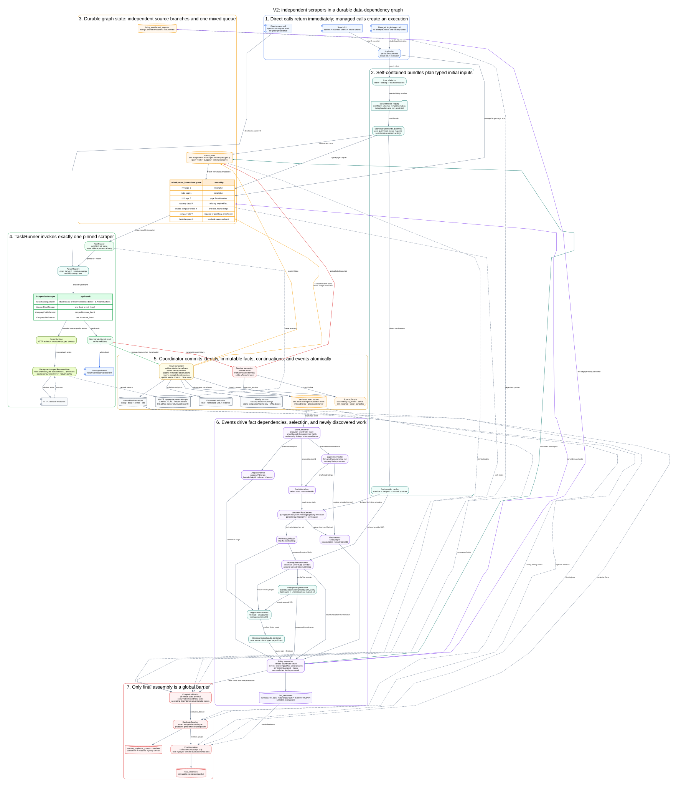
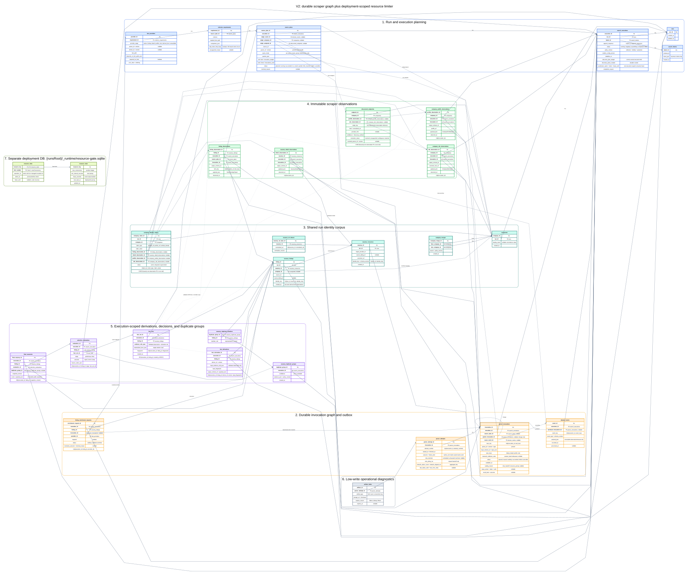

# V2 To-Be Independent Scraper Graph Flow

Status: implemented flow for the current HTTP source catalog.

## Diagrams

- [Event-driven task graph SVG](./v2-to-be-scraper-contract-event-graph.svg)
  ([Graphviz source](./v2-to-be-scraper-contract-event-graph.dot))
- [Database schema SVG](./v2-to-be-scraper-contract-db-schema.svg)
  ([Graphviz source](./v2-to-be-scraper-contract-db-schema.dot))
- [Full contract architecture](./v2-to-be-scraper-contract-architecture.md)





## Direct Versus Managed Calls

The same scraper bundle has two explicit call paths:

```text
direct:
  DirectScraperExecutor -> scraper -> typed result
  no run, queue, observation, event, or final snapshot

managed:
  V2SearchApplication -> GraphSearchPipeline -> execution + durable invocations
  -> scraper -> immutable observations + graph events
```

Both paths use the deployment-scoped `ResourceGate`. Direct listing callers own
returned continuations. The rest of this document follows a managed search.

## One Concrete Search

The user runs:

```bash
job-harness-v2 search \
  --query "QA Engineer" \
  --source hh_ru \
  --source habr_career \
  --grade middle \
  --salary-minimum 250000 \
  --salary-currency RUB \
  --salary-period month \
  --work-format remote \
  --vacancy-geography country:RU
```

The application stores a normalized business intent:

```json
{
  "queries": ["QA Engineer"],
  "grades": ["middle"],
  "compensation": {
    "minimum": 250000,
    "currency": "RUB",
    "period": "month",
    "gross": null
  },
  "workFormats": ["remote"],
  "vacancyGeography": ["country:RU"],
  "sources": ["hh_ru", "habr_career"]
}
```

No request timeout, delay, retry count, concurrency, page cursor, or source id
lookup appears in this intent.

## From Intent to Initial Tasks

1. `SourceSelector` chooses two source instances: `hh_ru` and
   `habr_career`.
2. The catalog returns each source's self-contained `SearchScraperBundle`.
3. Each bundle's pure `planInitial` maps only supported criteria into its
   source-specific typed input.
4. `GraphCoordinator` stores one `source_plan` per source/query group and
   creates the returned initial invocations.

Example HH input:

```json
{
  "sourceId": "hh_ru",
  "targetProviderId": "hh_ru",
  "queries": ["QA Engineer"],
  "target": {"kind": "catalog"},
  "cursor": {"kind": "initial"},
  "nativeFilters": {},
  "resolvedState": null
}
```

The HH listing manifest declares only query as native request support. Grade and
the complete compensation criterion are evaluated from structured output; the
bundle must not send only a numeric minimum and silently discard currency or
period. The coordinator does not know HH parameter names. If HH requires an area
id, the first invocation may resolve it through `ParserRuntime` and fetch page 1
in the same bounded call. The page 2 continuation carries the resolved state. A
zero-unit continuation is reserved for protocols whose bootstrap response
cannot yet emit a listing unit.

## Mixed Durable Queue

The initial queue contains:

| Invocation | Parser | Source plan | Runnable |
| --- | --- | --- | --- |
| HH initial/page 1 | HH listing bundle | HH | immediately |
| Habr page 1 | Habr listing bundle | Habr | immediately |

`TaskRunner` leases any runnable invocation and looks up the exact pinned
`parserId + parserVersion` in `ParserRegistry`. It does not select a parser by
URL at execution time.

Runnable work is leased as two fair branches: listing continuations and
enrichment (`detail/profile/site`). A single bounded SELECT returns candidates
and active counts for both. Free slots go to the branch with fewer active
tasks; an equal count uses the oldest ready task. Thus HH page 2 and details
from HH page 1 can run together, while either branch still progresses with a
single worker. This policy adds no separate scheduling-history writes.

The runner performs non-blocking resource preflight before an attempt exists,
then the parser performs bounded source-specific work only through
`ParserRuntime`:

```text
TaskRunner
  -> ParserRegistry exact lookup
  -> bundle.build_action(typed input)
  -> ResourceGate.try_admit
       delayed -> invocation waiting(resource_pacing), no attempt or lease held
       admitted -> begin parser_attempt
  -> scraper.execute(typed input, ParserRuntime)
  -> ParserRuntime resolves and validates the target outside the event loop
  -> HTTP transport connects to a pinned public IP with original Host/TLS SNI
  -> typed parser result
```

Each redirect target is resolved, validated, admitted, and pinned as a new
network action. Cross-origin redirects do not carry authorization or cookie
headers. A hostname is never resolved a second time inside the transport, so a
DNS change cannot bypass the public-address check.

`RequestRetryPolicy` is the only retry decision owner. For a safe timeout,
network error, or explicit transient HTTP status, only the current page/URL
invocation moves to `waiting(retry_backoff)` with its next `available_at`.
Successful pages remain terminal and are not fetched again. Direct calls use the
same decisions in memory; they never restart an earlier successful page.

Running invocations have a 30-second lease. The scheduler renews every active
lease with one batched 10-second heartbeat. Backoff and pacing waits hold no
lease. If the heartbeat disappears, the active attempt is recorded as
`worker_lost`, the invocation is requeued with a new lease token, and any stale
worker result is rejected.

## HH Page 1 Commits Without Waiting

An HH page result is structurally:

```json
{
  "kind": "search_listing",
  "outcome": "success",
  "items": ["SearchListingOutput A", "SearchListingOutput B"],
  "continuations": ["HH page 2 typed input"],
  "collectionUnitsConsumed": 1,
  "publicNotice": null
}
```

In one transaction, `GraphCoordinator`:

1. validates the result and active lease token;
2. upserts vacancy/company identity claims;
3. stores immutable listing observations A and B;
4. atomically reserves the HH source-plan budget for page 2;
5. inserts the HH page 2 invocation;
6. emits
   `listing_observations_stored([observation-A, observation-B])`;
7. updates source-plan counters;
8. marks page 1 succeeded.

After commit, HH page 2 is runnable even if event handling has not started.
Habr page 1 remains independently runnable.

For sources whose first page reveals several independent pages, the result may
return several `continuations`. They are accepted in one transaction only up to
the atomically reserved source-plan budget.

## Per-Listing Fact Planning

The event consumer handles immutable observation ids, never a mutable
convenience projection:

```text
listing observation A
  -> FactMaterializer
  -> versioned FactDerivers
  -> fact set A-v1 (observation ids + derivation ids)
  -> PreliminarySelector
  -> FactRequirementPlanner
```

Assume A has an explicit remote signal but no salary and no description:

| Requirement | Available fact | Declared providers | Decision |
| --- | --- | --- | --- |
| remote | listing output | listing | satisfied |
| compensation >= 250000 RUB/month | unknown | listing salary, declared detail salary provider | schedule detail only when its manifest declares the missing dimensions |
| grade middle | native grade | listing | evaluate now |
| application channel | not selection-required | detail, company site | defer |

The coordinator creates one detail invocation and a consumer edge:

```text
listing_enrichment_requests
  execution = E1
  listing = A
  invocation = detail-task-A
  provider = <provider id selected from the detail parser manifest>
  required = true
  status = waiting
```

The internal company-enrichment policy adds optional profile/site providers only
when the registry contains the corresponding verified scraper. A trusted
official site from the listing runs the generic company-site scraper directly.
If the listing has only an HH profile URL, the fallback is HH profile -> verified
official site -> generic company-site scraper. It begins only after preliminary
keep, does not search by bare company name, and does not block another source
branch.

When detail A arrives, canonical compensation uses only structured minimum,
maximum, currency, period, and gross/net fields. It does not parse or guess a
dimensioned minimum from display text. Persisted derivations record the deriver
version and exact listing/detail observation ids used as input. Derived
geography, remote scope, work format, and grade follow the same evidence rule
and never become parser output.

Relocation and visa sponsorship remain separate facts throughout this path.
Only explicit relocation assistance/package evidence satisfies a relocation
criterion. A detail page that offers visa sponsorship but requires the employee
to already be in another country is recorded as `visa_sponsorship = true` and
still fails `relocation = true`.

## Detail, Profile, and Site Are Independent Scrapers

A detail scraper input is only:

```json
{
  "targetProviderId": "hh_ru",
  "vacancyUrl": "https://hh.ru/vacancy/123",
  "sourceListingId": "123"
}
```

It can be called directly without a run and returns only
`VacancyDetailResult`. The managed repository/task-runner path can persist the
same typed call without a source plan; it upserts a standalone
`vacancy_resource` and stores an immutable `vacancy_detail_observation`. A
listing may link to that resource now or later. The current public CLI exposes
managed search and direct single-target execution, not a separate managed
single-target command.

The same rule applies to profile and site scrapers:

```text
CompanyProfileInput = provider + profile URL + optional provider company id
CompanySiteInput    = employer site URL
```

They return their own facts only. They do not receive a listing snapshot,
criteria, requested sections, timeout, delay, or downstream parser id.

## Shared Enrichment Fans Out to Consumers

Suppose listings A, C, and D reference the same HH employer profile:

1. The first request creates one deterministic profile invocation.
2. Later requests reuse that invocation.
3. Three `listing_enrichment_requests` rows attach A, C, and D as consumers.
4. `company_profile_observation_stored` rebuilds the relevant fact set for all
   three listings.
5. A terminal profile failure also settles all three dependency edges.

`parentInvocationId` records lineage but is not used as the consumer list.

## Resolving a Company Target

Before creating profile/site work, `EmployerTargetResolver` inspects trusted
stored candidates:

```text
listing/detail company URL
trusted source-catalog mapping
verified redirect alias
profile output officialSiteUrl
```

It may return a resolved profile/site/career target, `ambiguous`,
`rejected_unsafe_target`, or `unresolved_no_trusted_url`. A listing containing
only `company.name = "Acme"` stops at `unresolved_no_trusted_url`. The first
implementation never performs a network search from a bare company name.

This resolver generates no URL. URLs originate from a scraper observation,
trusted catalog entry, or verified redirect. It only validates and routes them.

## Company Site to Career Listing Source

A company-site result may contain:

```json
{
  "kind": "career_listing",
  "url": "https://company.example/jobs",
  "providerHint": "workday",
  "confidence": "confirmed",
  "discoveryMethod": "platform_signature"
}
```

The site scraper does not invoke Workday. The coordinator stores the endpoint,
then `TargetParserResolver` returns exactly one routing outcome:

```text
resolved(parser id/version/provider)
unsupported
ambiguous(candidate parser ids)
rejected_unsafe_target
```

For `resolved`, the coordinator creates a discovered `source_plan` with links
to the source event, company, and stored endpoint. The chosen listing bundle's
`planInitial` produces the first career-listing invocation. Its listings then
follow the same observation, selection, and enrichment flow as HH listings.

Normalized endpoint identities, task-key dedupe, the persisted execution
discovered-source-plan budget, and each source plan's own unit/item/invocation
budgets bound recursive discovery.

## Re-Evaluation Uses Exact Fact Sets

When detail A completes:

```text
vacancy_detail_observation_stored(detail-observation-A)
  -> find all listing consumers
  -> run/reuse applicable versioned FactDerivers
  -> create fact set A-v2 from exact observation + derivation ids
  -> evaluate required criteria
  -> final keep or reject
```

Profile and site observations use the same path when their fact paths are
declared providers for a requested criterion. A final evaluation stores
`factSetId`, so an append execution cannot silently change its evidence.

An optional observation excluded from selection may enrich presentation but
does not invalidate the decision.

## Independent Source-Branch Completion

Every `source_plan` terminates separately:

| Outcome | Condition |
| --- | --- |
| `succeeded` | At least one accepted item and every continuation branch exhausted. |
| `no_results` | No items, no branch failures, all branches exhausted. |
| `partial` | Usable items plus a partial result or terminal branch failure. |
| `limit_reached` | Collection/item budget reached normally. |
| `failed` | No usable items and a terminal branch failure. |
| `cancelled` | Deadline or user cancellation. |

A failed HH branch does not stop Habr, a discovered Workday source, or already
queued detail work. Its source plan enters one terminal state without a
redundant outbox event, and the global execution continues.

`collection_units_used` counts listing pages/cursor batches.
`invocations_used` additionally counts zero-unit bootstrap calls.
`ResourceGate` separately counts real network actions.

### Session-bound browser source

Most sources use `invocationScope = stateless_unit` and commit after each
page/batch. A captured browser source that requires one live session declares
`session_batch`:

```text
coordinator reserves N collection units
-> one browser invocation consumes at most N pages/batches
-> cookies remain inside that invocation
-> observations/events commit when the session batch returns
```

It receives no page-level interleaving inside that batch. A continuation is
legal only when a fresh session can resume from a non-secret cursor.

## Deployment-Scoped Resource Limits

All direct and managed calls under one `runsRoot` acquire resource slots from:

```text
{runsRoot}/_runtime/resource-gate.sqlite
```

Therefore two concurrent CLI searches cannot independently exceed HH
concurrency or delay. Fixed resource-slot rows are reused and their ownership
expires after process crashes, so the limiter table does not grow per request. A multi-host
deployment must replace this SQLite backend with a shared linearizable lease
store; process-local fallback is not allowed.

## Persistence I/O Shape

The hot path avoids row-per-detail normalization:

```text
one parser-result transaction
  -> bulk-load existing identities/tasks for the entire result
  -> N immutable output observations
  -> all accepted continuation tasks
  -> one batch event
  -> one source counter update
  -> one invocation terminal update

one selected event batch under the execution coordinator lease
  -> batched observation reads
  -> at most one newest compact fact_set per affected listing
  -> derivations/evaluation/tasks only when the fact fingerprint changed
  -> validate coordinator token and mark the selected batch processed
```

Result keys are normalized in memory, existing identities and deterministic
task keys are loaded set-wise, and requirements/provider rows are loaded once
per selected event batch. Shared tasks that completed before a new consumer was
attached are detected by one set-based batch query and reused from their
immutable observation. The only per-listing read left on the normal materialize
path is the terminal dependency check; it is required only when provider edges
must be settled. Final assembly reads evaluations and fact snapshots in bounded
batches instead of rereading them per vacancy.

`fact_set` contains one materialized-facts JSON plus evidence-id JSON; there are
no listing/detail/profile/site member rows. The graph DB keeps only aggregate
parser-attempt diagnostics: network-action count, network elapsed time, last
HTTP status, and last error class. They are written in the existing terminal
attempt update. The current runtime writes neither per-network-action telemetry
nor raw response artifacts; `artifact_index` is reserved for a future explicit
failure/debug capture policy.

Each network action still requires limiter coordination, but only in the
separate deployment DB: one short acquire transaction updates pacing and claims
a fixed slot, and one update releases it. No database transaction stays open
while HTTP or browser work is running.

This avoids normalized fact-set member tables, per-network-action rows in the
graph database, and redundant source-terminal events. Immutable observations,
task leases, aggregate attempts, source counters, and final decisions remain
durable.

## Cross-Source Duplicate Handling

Exact evidence such as the same provider vacancy id, normalized canonical/direct
vacancy URL, or explicit aggregator-to-employer vacancy link resolves to one
`vacancy_resource`. Exact members share detail work and become one final item
with source variants.

A strongly resolved same company plus similar title/location/date creates only
a `probable` duplicate group. Probable members keep separate detail tasks, fact
sets, evaluations, and final items. They are never silently removed.

## Final Global Barrier

There is no barrier between listing and enrichment work. Final assembly starts
only when:

- all source plans are terminal;
- no parser invocation is queued, leased, or waiting;
- no event is unprocessed;
- no listing dependency waits on a non-terminal invocation;
- no valid lease can still commit;
- the drain transaction creates no new work.

`DuplicateResolver` finalizes exact/probable groups first. `FinalAssembler` then
reads terminal evaluations and immutable fact sets, collapses exact groups only,
and performs ranking, top-N, and field projection into an execution-scoped
snapshot.

The final receipt, processed JSON, and HTML report expose
`execution_quality = complete | degraded | failed` and `source_coverage`.
Coverage reports planned, complete, degraded, failed, and per-status source
counts, so partial operational failure remains visible even when usable
vacancies were committed.

## Full Ownership Chain

| Step | Owner | Durable output | Work unlocked |
| --- | --- | --- | --- |
| 1 | Application | intent + execution | source selection |
| 2 | `SourceSelector` | selected source instances | bundle planning |
| 3 | Listing bundles | typed initial inputs | initial source plans/tasks |
| 4 | `TaskRunner` + `ResourceGate` | preflight result, then task lease | one exact admitted parser call or durable `resource_pacing` wait |
| 5 | Parser + runtime | typed result + invocation-local attempt metrics | result transaction |
| 6 | `GraphCoordinator` | immutable observations + continuations + event, or request-level `retry_backoff` | next pages and event handling |
| 7 | Fact materializer + derivers | derived facts + exact fact sets | evidence-aware selection |
| 8 | Selectors/provider planner | evaluations + dependency edges | minimum required enrichment |
| 9 | Two-branch fair mixed queue | listing/detail/profile/site tasks | independent graph progress without branch starvation |
| 10 | Employer/target resolver | trusted resolved target or explicit unresolved outcome | profile/site/discovered source work |
| 11 | Duplicate resolver | exact/probable groups | safe detail reuse and final grouping |
| 12 | Source lifecycle | terminal source outcome | execution drain |
| 13 | Final assembler | immutable final snapshot | report/API output |

## Public Versus Internal Data

| Public parser facts | Workflow-derived | Operational only |
| --- | --- | --- |
| listings, details, profiles, sites, discovered endpoints | criteria/providers, derivations, fact sets, target resolution, evaluations, duplicate groups/rank | queries attached to requests, cursors, resolved state, URLs fetched, timing, retries, raw payloads, leases |

Public output never includes result-page rank, raw source arrays, request delay,
timeout, source-page URL, queue settings, or the search query that produced the
row.

## Storage Groups

| Group | Main records |
| --- | --- |
| Planning | runs, executions, intents, source plans, criterion requirements/providers |
| Durable graph | parser invocations, listing enrichment requests, event outbox |
| Identity | vacancy resources/aliases, companies, company identity claims, duplicate groups |
| Immutable facts | listing, detail, profile, and site observations; discovered endpoints |
| Derived | fact derivations, compact fact-set snapshots, evaluations, duplicate groups, final snapshots |
| Operational | aggregate parser attempts; reserved failure/debug artifact index |
| Deployment limiter | shared resource state and fixed crash-expiring resource slots under `runsRoot/_runtime` |

## Regenerating Diagrams

```bash
dot -Tsvg docs/v2-to-be-scraper-contract-event-graph.dot \
  -o docs/v2-to-be-scraper-contract-event-graph.svg

dot -Tsvg docs/v2-to-be-scraper-contract-db-schema.dot \
  -o docs/v2-to-be-scraper-contract-db-schema.svg
```
